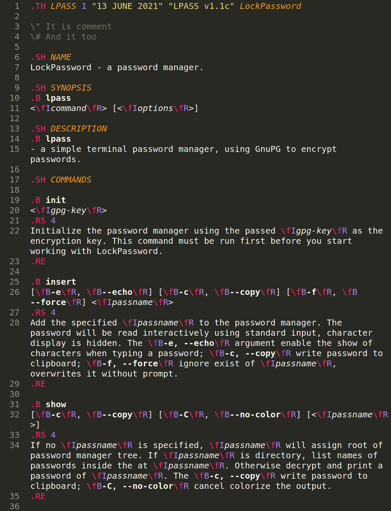
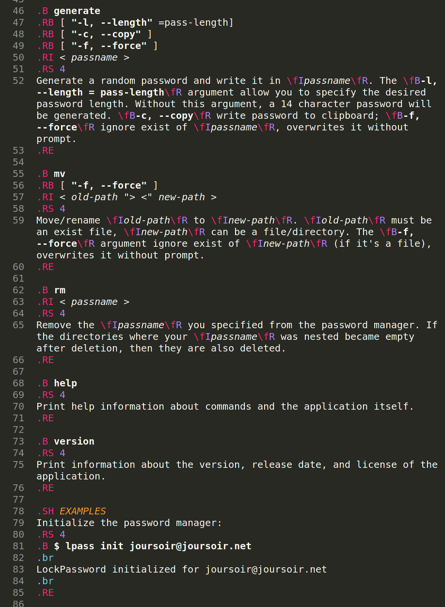

# Sublime manual page syntax

Sublime text 3 syntax highlighting for man pages supporting different \*roff (example of \*roff: roff, groff, nroff and etc)

# Installation:

Copy `man.sublime-syntax` into `path/to/subl-text-3/Data/Packages/User` folder

For example here is the path to sublime text folder in my Linux: `~/.config/sublime-text-3/Packages/User`

# Screenshot:

# Useful links:

* [groff](https://www.gnu.org/software/groff/manual/groff.html)
* [Oniguruma Regular Expressions Version 5.9.1](https://raw.githubusercontent.com/kkos/oniguruma/5.9.6/doc/RE)
* [Sublime text syntax](http://www.sublimetext.com/docs/syntax.html)
